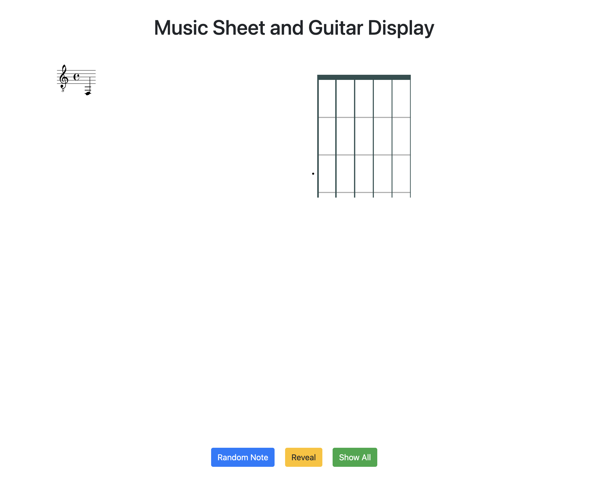
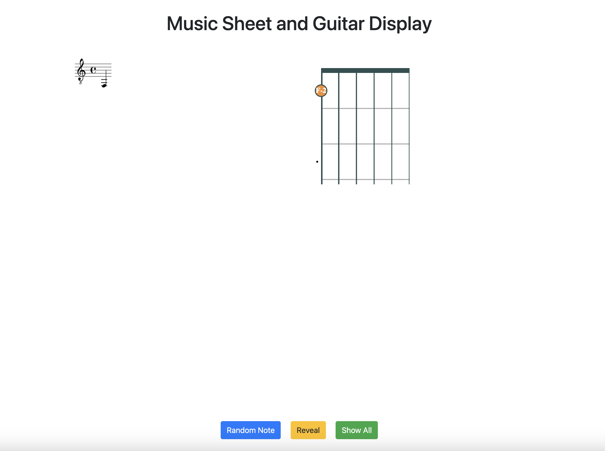
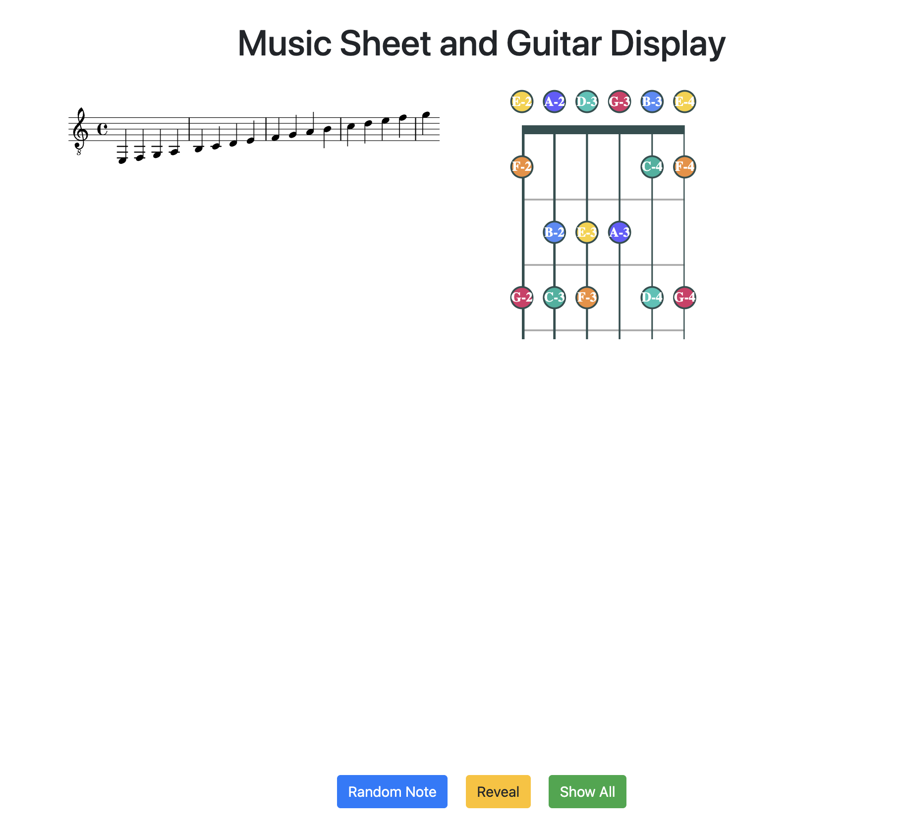

# Guitar Get Gud
## What?
An app to learn music sight-reading on the guitar.
## How?
Run
```
python main.py
```
You'll need to install some python dependencies (flask, fretboard,
mingus) and stuff for HTML web dev like bootstrap ect.


1. Hit random note to generate a random note on the sheet music

2. Hit reveal button to see the note on the fretboard along with the note name

3. Hit show all to reveal all the notes on the fretboard and the sheet for your review.
